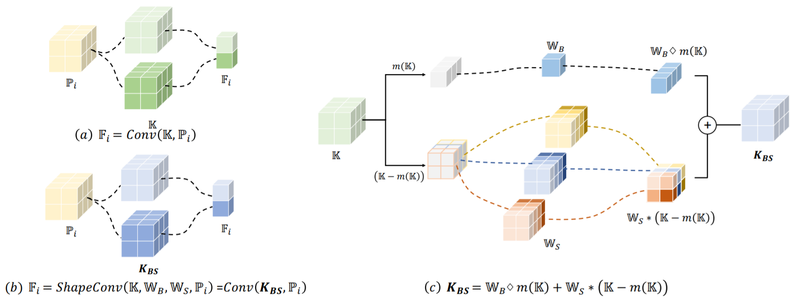

# Shape-aware Convolutional Layer (ShapeConv) 
PyTorch implementation of [ShapeConv: Shape-aware Convolutional Layer for RGB-D Indoor Semantic Segmentation](https://).


## Introduction
We design a Shape-aware Convolutional(ShapeConv) layer to explicitly model the shape information for enhancing the RGB-D semantic segmentation accuracy. Specifically, we decompose the depth feature into a shape-component and a value component, after which two learnable weights are introduced to handle the shape and value with differentiation. Extensive experiments on three challenging indoor RGB-D semantic segmentation benchmarks, i.e., NYU-Dv2(-13,-40), SUN RGB-D, and SID, demonstrate the effectiveness of our ShapeConv when employing it over five popular architectures.



## Usage
### Installation
1. Requirements

- Linux
- Python 3.6+
- PyTorch 1.7.0 or higher
- CUDA 10.0 or higher

We have tested the following versions of OS and softwares:

- OS: Ubuntu 16.04.6 LTS
- CUDA: 10.0
- PyTorch 1.7.0
- Python 3.6.9

2. Install dependencies.
```shell
pip install -r requirements.txt
```
### Dataset
Download the offical dataset and convert to a format appropriate for this project. See [here](./data_preparation).

Or download the converted dataset:
- [NYU-V2](https://)
- [SUN-RGBD](https://)
- [SID](https://)

### Evaluation
1. Model
   
   Download trained model and put it in folder `./model_zoo`.
See all trained models [here](./model_zoo/README.md).
   
2. Config

    Edit config file in `./config`.
    The config files in `./config` correspond to the model files in `./models`.
   1. Set `inference.gpu_id = CUDA_VISIBLE_DEVICES`. 
      `CUDA_VISIBLE_DEVICES` is used to specify which GPUs should be visible to a CUDA application,
      e.g., `inference.gpu_id = "0,1,2,3"`.
   2. Set `dataset_root = path_to_dataset`. 
      `path_to_dataset` represents the path of dataset.
      e.g.,`dataset_root = "/home/shape_conv/nyu_v2"`.
3. Run
   1. Ditributed evaluation, please run:
    ```shell
   ./tools/dist_test.sh config_path checkpoint_path gpu_num
    ```
   - `config_path` is path of config file; 
   - `checkpoint_path`is path of model file;
   - `gpu_num` is the number of GPUs used, note that `gpu_num <= len(inference.gpu_id)`.
    
   E.g., evaluate shape-conv model on NYU-V2(40 categories), please run:
   ```shell
   ./tools/dist_test.sh configs/nyu/nyu40_deeplabv3plus_resnext101_shape.py model_zoo/nyu40_deeplabv3plus_resnext101_shape.pth 4
    ```
   2. Non-distributed evaluation
   ```shell
   python tools/test.py config_path checkpoint_path
   ```

### Train
1. Config

    Edit config file in `./config`.
   1. Set `inference.gpu_id = CUDA_VISIBLE_DEVICES`. 
      
      E.g.,`inference.gpu_id = "0,1,2,3"`.
   2. Set `dataset_root = path_to_dataset`. 
      
      E.g.,`dataset_root = "/home/shape_conv/nyu_v2"`.

2. Run
    1. Ditributed training
    ```shell
    ./tools/dist_train.sh config_path gpu_num
    ```
    E.g., train shape-conv model on NYU-V2(40 categories) with 4 GPUs, please run:
    ```shell
    ./tools/dist_train.sh configs/nyu/nyu40_deeplabv3plus_resnext101_shape.py 4
    ``` 
   2. Non-distributed training
    ```shell
    python tools/train.py config_path
    ```
## Result
For more result, please see [model zoo](./model_zoo/README.md).
### NYU-V2(40 categories)
| Architecture | Backbone | MS & Flip | Shape Conv | mIOU |
|:---:|:---:|:---:|:---:| :---:|
| DeepLabv3plus | ResNeXt-101 | False | False | 48.9% |
| DeepLabv3plus | ResNeXt-101 | False | True | 50.2% |
| DeepLabv3plus | ResNeXt-101 | True | False | 50.3% |
| DeepLabv3plus | ResNeXt-101 | True | True | 51.3% |
### SUN-RGBD
| Architecture | Backbone | MS & Flip | Shape Conv | mIOU |
|:---:|:---:|:---:|:---:| :---:|
| DeepLabv3plus | ResNet-101 | False | False | 46.9% |
| DeepLabv3plus | ResNet-101 | False | True | 47.6% |
| DeepLabv3plus | ResNet-101 | True | False | 47.6% |
| DeepLabv3plus | ResNet-101 | True | True | 48.6% |
### SID(Stanford Indoor Dataset)
| Architecture | Backbone | MS & Flip | Shape Conv | mIOU |
|:---:|:---:|:---:|:---:| :---:|
| DeepLabv3plus | ResNet-101 | False | False | 54.55% |
| DeepLabv3plus | ResNet-101 | False | True | 60.6% |

## Acknowledgments
This repo was developed based on [vedaseg](https://github.com/Media-Smart/vedaseg).
